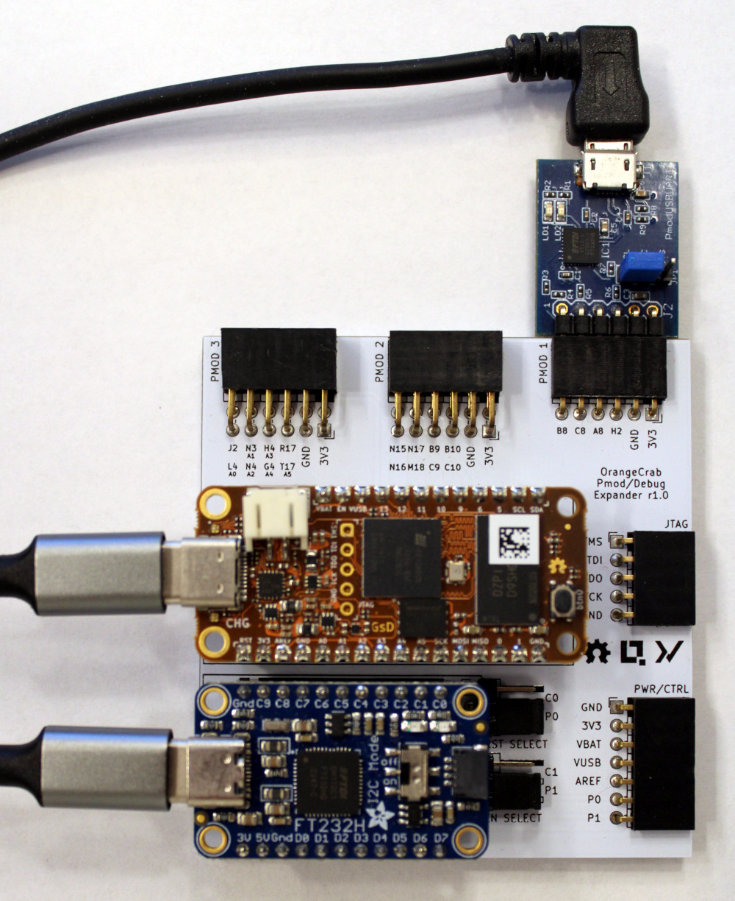

# clash-crypto

:warning: _This library still is in an experimental state._ :warning:

This repository contains cryptographic primitive hardware designs
written in [Clash](https://clash-lang.org), where the following
primitives are currently supported:

* Secure hashing according to
  [FIPS 180-4](https://dx.doi.org/10.6028/NIST.FIPS.180-4).
* Keyed-Hash Message Authentication Code (HMAC) according to
  [FIPS 198-1](https://doi.org/10.6028/NIST.FIPS.198-1).
* Elliptic Curve Digital Signature Algorithm (ECDSA) according to
  _Section 6_ of [FIPS 186-5](https://doi.org/10.6028/NIST.FIPS.186-5).
* Deterministic Nonce Generation for ECDSA according to _Appendix 3.3_
  of [FIPS 186-5](https://doi.org/10.6028/NIST.FIPS.186-5).

Additionally, the following extended Clash utility primitives are
offered by this library:

* A _cryptographic logic unit (CLU)_, which selects and executes among
  the following large number operations in a modulo field:
  - Addition
  - Substraction
  - Multiplication
    _(using
    [Karatsuba](https://en.wikipedia.org/wiki/Karatsuba_algorithm))_
  - Modulo Inverse
    _(using [FLT-CTMI](https://doi.org/10.1007/978-3-031-25319-5_5),
    requires the modulus to be prime_)
  - Bit Tests
* A _calculator unit_: allows the execution of constant size,
  non-recursive routines over large numbers in different modulo fields
  working on a stack memorizing intermediate results.
* A well-defined _Instruction Set Architecture (ISA)_ for the calculator.
* A single-cycle operating _feature extended stack_.
* The _`Channel` interface_: an extension of Clash's `Signal`
  additionally keeping track of the availability and temporal
  stability of the data it captures.
* The _`DataStream` interface_: a `Signal` over fixed-sized data
  `Frame`s for the transfer of variable-sized data messages over
  multiple cycles.

## Nix

This repository offers several Nix development shells via
[`flake.nix`](./flake.nix) primarily providing all the required
Haskell dependencies and the FPGA & hardware related development
tooling. The development shell can be entered using `nix develop`,
which makes typical Haskell tools available (`cabal`, `ghc`) as well
as FPGA tooling (`yosys`, `nextpnr`). The project uses `shellFor`,
which means that all the dependencies of `clash-crypto` are first
built through Nix and then made available to `cabal`.

Beside the default shell there are also extended shells with:

* OCaml Package Manager support: `nix develop .#withOpam`
* Haskell Language Server support: `nix develop .#withHLS`
* all of the aforementioned features: `nix develop .#allFeatures`

Automatic loading of development shells on entering the directory
can be set up using [direnv](https://github.com/nix-community/nix-direnv).

_For the reminder of this document we assume all commands to be
executed after entering at least the default shell without further
mentioning._

## Documentation

This library uses [Haskell Haddock
Documentation](https://haskell-haddock.readthedocs.io/latest), which
can be generated from the source code (the default target is _html_)
and opened via running

```
cabal haddock --open
```

## Test Infrastructure

### Simulation Tests

All of the aforementioned primitives come along with property based
simulation tests, which are available via the Haskell-based
`simulation` testsuite. Simply run

```
cabal run -- simulation -l
```

to print a list of all the available test cases. Specific cases can be
selected via passing a pattern that matches the desired test cases by
name, e.g., using

```
cabal run -- simulation -p SHA-256
```

runs only the `SHA-256` related tests.

### Hardware-in-the-Loop Tests

Beside simulation tests, hardware-in-the-loop tests (HITLT) are
available through the `hitlt` test suite. Printing the available tests
and pattern-based selection works the same way as for the simulation
tests. However, do not expect HITLT to work out of the box as they
further require a particular hardware development setup being
physically connected to the executing host.

We are using the following hardware components for HITL testing:

* [OrangeCrab FPGA](https://orangecrab-fpga.github.io/orangecrab-hardware/docs/r0.2.1)
  _(r0.2.1, ECP5-85F variant)_
* [Adafuit FT232H JTAG programmer](https://adafruit.com/product/2264)
* [Digilent PmodUSBUart](https://digilent.com/reference/pmod/pmodusbuart/start)
* [OrangeCrab Pmod & Debug Breakout
  PCB](https://github.com/kleinreact/orangecrab-pmod-breakout)

with the FPGA and FT232H connected to their dedicated slots on the
breakout PCB and the `PmodUSBUart` connected to the slot labeled `PMOD
1`. Moreover, all three devices must be connected via USB to the host.

<p align="center">

</p>

On a Linux-based host it is further recommended to

* copy [`90-orangecrab.rules`](./.github/setup/90-orangecrab.rules) to
  `/etc/udev/rules.d/90-orangecrab.rules`
* copy [`unique-device-num`](./.github/setup/unique-device-num) to
  `/etc/udev/scripts/unique-device-num`
* make `/etc/udev/scripts/unique-device-num` executable
* activate the rules via `sudo udevadm control --reload`

HITL tests can be run using `cabal run -- hitlt`, which queries
the appropriate package defined in the flake for uploading its
bitstream to the FPGA. The packages can be found under the `hitlt`
prefix:

```
$ nix build .#packages.x86_64-linux.hitlt.
.#hitlt.BEA            .#hitlt.HMACSHA512     .#hitlt.SHA256
.#hitlt.FastGCD        .#hitlt.HMACSHA512224  .#hitlt.SHA384
(...)
```

Each entry represents a derivation building a packed bitstream for
uploading. Every package moreover adds an `app` entry, which simply
calls `ecpprog` with subsequent arguments as well as the path to
the corresponding bitstream:

```
$ nix run .#apps.x86_64-linux.hitlt.SHA1.upload -- --help
Simple programming tool for Lattice ECP5/NX using FTDI-based JTAG programmers.
```

## Formal Proofs

Several Rocq proofs can be found in the [`RocqProofs`](./RocqProofs) folder. The
`opam` tool (a dependency management tool for Rocq libraries) is
available via the `withOpam` Nix development shell.

The first time execute

```
opam repo add rocq-released https://rocq-prover.org/opam/released
opam repo add coq-released https://coq.inria.fr/opam/released
```

to bring the required references to the dependencies into scope and then install
the following libraries:

- [`coq-bits`](https://github.com/rocq-community/bits) offering a Rocq
equivalent to `BitVector` on which we can reason easily,
- [`coq-equations`](https://github.com/mattam82/Coq-Equations), a nice framework
for defining functions using equational reasoning,
- [`mathcomp`](https://github.com/math-comp/math-comp), a full-fledged library
for mathematical representations, and
- [`coq-mathcomp-zify`](https://github.com/math-comp/mczify), offering
  automated reasoning tactics such as `lia` on mathcomp-based
  propositions

via `opam install <package>`. It also installs a suitable version of
Rocq, such as 8.16.1.

Further type-level related proofs can be found in
[src/Data/Constraint/Nat/Extra.hs](./src/Data/Constraint/Nat/Extra.hs),
which are not checked automatically via continuous integration. Instead,
they must be manually verified via toggling the corresponding
[ghc-typelits-proof-assist](https://github.com/clash-lang/ghc-typelits-proof-assist)
plugin flag at the top of the file.

## Developer Notes

### Inspecting synthesis targets

Each synthesis target consists of three main steps, each of which is a
separate derivation:

* `.#packages.x86_64-linux.hitltHsPkgs.clash-crypto`:
  the build output of the `clash-crypto` library without running any tests
* `.#packages.x86_64-linux.hitlt.SHA1.src`:
  the Verilog result of running Clash on an environment with `clash-crypto`
* `.#packages.x86_64-linux.hitlt.SHA1`:
  the result of running the appropriate synthesis tools to build a
  bitstream from the Verilog input

Each of these artifacts can be built separately with `nix build`.

Some useful tricks for inspecting the build:

* You can pass `nix build -L` to output the build log as it is
  generated on `stderr`. This might especially be helpful for long
  place-and-route processes and such.
* You can look up the log of a build with `nix log ...`.
* You can inspect the commands run by common `stdenv` phases with
  `nix eval --raw`:

  ```
  $ nix eval --raw .#packages.x86_64-linux.hitlt.SHA1.src.buildPhase
  export PATH=/nix/store/(...)-ghc-9.10.3-with-packages/bin:$PATH
  clash \
    -package-db /nix/store/(...)-ghc-9.10.3-with-packages/lib/ghc-*/lib/package.conf.d \
    -outputdir . \
    --verilog \
    -fclash-clear \
    '-fclash-spec-limit=100' \
    '-fclash-inline-limit=100' \
    '-fconstraint-solver-iterations=20' \
    SHA -main-is topEntitySHA1

  $ nix eval --raw .#packages.x86_64-linux.hitlt.SHA1.src.installPhase
  mkdir -p $out
  mv SHA.topEntitySHA1/* $out
  rm $out/clash-manifest.json
  ```

This should give you enough information to run the command interactively if
needed.

### Changing synthesis targets

The source of truth is in `flake.nix`, but here are some hints on altering the
build:

* Any settings affecting both compilation and test running go into
  `build-config.nix` and `build-config-local.nix`. In particular the baud rate
  is set there.
* The HITLT configuration is in `nix/hitl.nix`. The steps in the synthesis chain
  can all accept extra flags. See also `onlyClash` and `ecp5.synthesize` in
  `nix/clash.nix` for options accepted by `ecp5.clash`.
* Passing extra flags to `clash` can be configured globally in
  `hitltBaseArgs` and per-target in `hitltTopEntities`.
* Some particular flags that might be useful:
  * `synthFlags` is passed to `synth_ecp5` in the Yosys script
